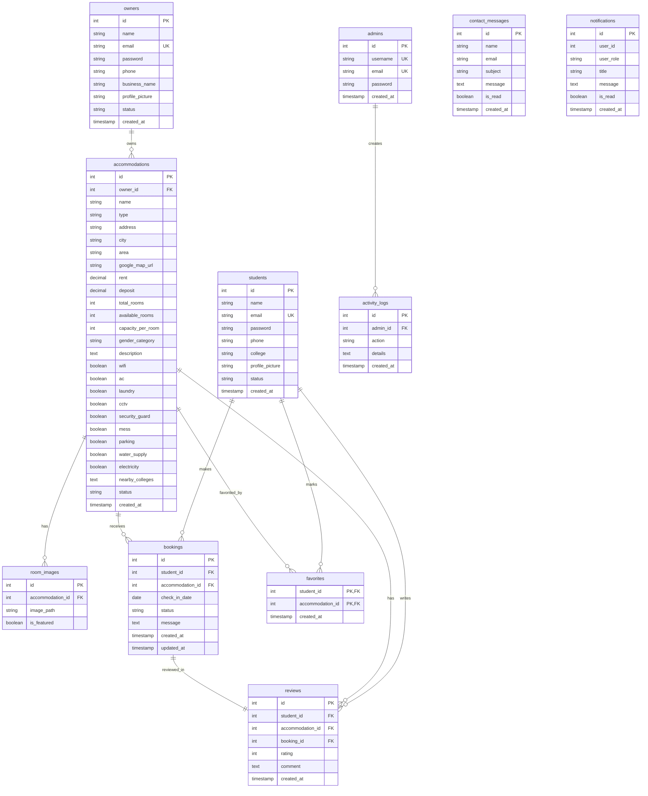

# NestFinder: Student Accommodation Management Portal

NestFinder is a complete, production-ready, full-stack student accommodation portal. It is designed to connect students searching for housing near universities with accommodation owners listing hostels, PGs (Paying Guest), and flats. 

This platform utilizes **PHP 8+**, **MySQL**, **Bootstrap 5**, and **Vanilla Javascript (ES6)**. It features role-based access control for three entities: **Students**, **Landlords (Owners)**, and **Administrators**.

> [!IMPORTANT]
> ### 🔑 Default Testing Credentials (Pre-seeded)
> After executing `database/seed.php`, use the following accounts to access each portal role:
> 
> * **Platform Administrator**:
>   - **Username / Email**: `admin` *(or admin@nestfinder.com)*
>   - **Password**: `AdminPassword123`
>   - **Dashboard**: `http://localhost/student-accommodation/admin/`
> 
> * **Accommodation Owner (Host)**:
>   - **Email**: `robert@owner.com` *(or alice@owner.com)*
>   - **Password**: `OwnerPassword123`
>   - **Dashboard**: `http://localhost/student-accommodation/owner/`
> 
> * **Student Tenant**:
>   - **Email**: `john@student.com` *(or jane@student.com)*
>   - **Password**: `StudentPassword123`
>   - **Dashboard**: `http://localhost/student-accommodation/student/`

---

## 📋 System Architecture & Data Schema

The database uses a normalized relational schema with cascaded deletions and indexes on heavily searched fields (such as location cities, rental values, gender types, and account verification states).

### Entity Relationship Diagram (ERD)



---

## 🛠️ Step-by-Step Installation & Deployment (XAMPP)

Follow this setup checklist to configure and run the project locally on your system:

### Prerequisite Requirements
- **Local Server**: XAMPP (with Apache & MySQL) or WAMP.
- **PHP Version**: `PHP 8.0` or higher.
- **Database**: `MySQL 5.7` or higher / MariaDB.
- **Web Browser**: Chrome, Firefox, Safari, or Edge.

---

### Step 1: Copy Source Code to Server Root
1. Navigate to your local server's web root directory:
   - **XAMPP**: `C:\xampp\htdocs\`
   - **WAMP**: `C:\wamp64\www\`
2. Create a folder named **`student-accommodation`**.
3. Copy all project directories and files from this repository directly into:
   `C:\xampp\htdocs\student-accommodation\`

---

### Step 2: Establish the Database Schema
1. Open the **XAMPP Control Panel** and click **Start** next to Apache and MySQL modules.
2. In your web browser, navigate to: `http://localhost/phpmyadmin/`.
3. Click on the **Databases** tab in the top navigation panel.
4. Under **Create database**, enter the name: **`student_accommodation_db`**.
5. Set collation to **`utf8mb4_unicode_ci`** and click **Create**.
6. Select the newly created `student_accommodation_db` from the left sidebar.
7. Click the **Import** tab in the top navigation menu.
8. Click **Choose File** (or Browse) and select the schema script:
   `C:\xampp\htdocs\student-accommodation\database\schema.sql`
9. Scroll to the bottom and click **Import** (or Go). The screen will report a successful import of all database tables.

---

### Step 3: Seed Sandbox Dummy Records
1. To automatically populate the database with testing accounts, approved listings, active bookings, notifications, and dummy logs, execute the seeder script in your web browser:
   - Navigate to: **`http://localhost/student-accommodation/database/seed.php`**
2. The browser screen will display:
   ```
   Starting database seeding...
   Seed: Admin account added (Username: admin, Password: AdminPassword123)
   Seed: 2 Student accounts added (Password: StudentPassword123)
   Seed: 2 Owner accounts added (Password: OwnerPassword123)
   Seed: 3 Accommodation listings created
   Seed: Room images associated
   Seed: 2 Booking requests created
   Seed: 1 Review posted
   Seed: Favorites populated for students
   Seed: Sample contact messages registered
   Database seeding finished successfully!
   ```
3. Once seeded, you are ready to log in and inspect the platform!

---

## 🔑 Pre-seeded Testing Accounts & Roles

Use these credentials to log in and inspect the different portals:

| Portal Role | Email / Username | Password | Dashboard Entrance URL |
| :--- | :--- | :--- | :--- |
| **Platform Administrator** | `admin` *(or admin@nestfinder.com)* | `AdminPassword123` | `http://localhost/student-accommodation/admin/dashboard.php` |
| **Accommodation Owner** | `robert@owner.com` | `OwnerPassword123` | `http://localhost/student-accommodation/owner/dashboard.php` |
| **Accommodation Owner** | `alice@owner.com` | `OwnerPassword123` | `http://localhost/student-accommodation/owner/dashboard.php` |
| **Student Tenant** | `john@student.com` | `StudentPassword123` | `http://localhost/student-accommodation/student/dashboard.php` |
| **Student Tenant** | `jane@student.com` | `StudentPassword123` | `http://localhost/student-accommodation/student/dashboard.php` |

---

## 🔄 Step-by-Step Portal Testing Scenarios

Use the following step-by-step scenarios to test the full-stack features of NestFinder:

### Scenario A: Booking and Inventory Pipeline (Student & Owner)
1. **Student Search**: 
   - Navigate to the home page: `http://localhost/student-accommodation/`.
   - In the search banner, search for **Boston** and select **PG**. Click **Search**.
   - You are redirected to `search.php`. Use the sidebar filters to refine properties and max rent prices.
2. **Reviewing Property**:
   - On the search results card, click **View Details** on **Apex Elite Boys PG**.
   - You can inspect the description, gallery, nearby colleges, ratings, and maps location.
3. **Student Log In**:
   - Under the booking section, click the link to **log in as student**.
   - Log in using Email: `john@student.com` and Password: `StudentPassword123`.
   - Click the checkmark to select a **check-in date** (e.g. next month) and click **Review & Book**.
4. **Checkout & Submission**:
   - You are redirected to `booking_checkout.php`. Inspect the charge details (Monthly rent, deposit, and total due).
   - Check the **Terms and Conditions** checkmark and click **Submit Request**.
   - You are redirected to `booking_history.php` showing a **PENDING** status badge.
5. **Landlord Approval**:
   - Log out of the student account and click **Log In** on the navbar.
   - Select **Owner** role and log in using Email: `robert@owner.com` and Password: `OwnerPassword123`.
   - Go to the **Booking Requests** sidebar link. You will see John Doe's reservation request for *Apex Elite Boys PG*.
   - Click **Approve**.
6. **Confirmation Verification**:
   - Log out and log back in as student `john@student.com`.
   - Navigate to your **Dashboard**. The booking card status has dynamically updated to **APPROVED**.
   - Inspect **My Properties** inside Robert's owner panel. The room inventory counter for *Apex Elite Boys PG* has automatically decremented to prevent double booking.

---

### Scenario B: Listings Moderation & Users Suspension (Admin & Landlord)
1. **List New Property**:
   - Log in as owner `robert@owner.com`.
   - Go to **My Properties** -> click **Add New Property**.
   - Fill in details for a new flat, check amenities (Wi-Fi, AC), upload gallery images, and click **Submit Listing**.
   - The listing appears on your table marked as **PENDING** and is not yet visible in public searches.
2. **Admin Verification**:
   - Log out and log in as administrator `admin` / `AdminPassword123`.
   - Go to **Properties Queue** sidebar link. Under the **Pending Verification** tab, your new listing is visible.
   - Click **Approve**.
   - Inspect the **Audit Logs** on the Admin Dashboard. The system has automatically recorded the approval action.
3. **Suspending Users**:
   - In the Admin panel, go to the **Students** sidebar link.
   - Click **Suspend** on student *John Doe*.
   - Log out and try logging in as `john@student.com`. The authentication middleware blocks access and alerts: `Your student account has been suspended`.

---

## 🛡️ Enterprise Security Implementations

This system enforces strict security standards to protect users and application data:

1. **SQLi Prevention (SQL Injection)**:
   - Emulated prepared statements are disabled: `PDO::ATTR_EMULATE_PREPARES => false`.
   - All queries use strict parameterized input binding.
2. **XSS Protection (Cross-Site Scripting)**:
   - All output data is passed through `htmlspecialchars($data, ENT_QUOTES, 'UTF-8')` before being rendered in HTML templates.
3. **CSRF Prevention (Cross-Site Request Forgery)**:
   - Form operations generate cryptographically secure tokens stored in `$_SESSION['csrf_token']` and validate them on form submission.
4. **Session Security**:
   - Session cookies utilize `httponly` settings to block scripts from reading cookies.
   - `session_regenerate_id(true)` is triggered upon login to prevent session fixation.
5. **Secure Hashing**:
   - Passwords are securely hashed using `password_hash()` and verified with `password_verify()`.
6. **File Upload Verification**:
   - Uploaded files are checked for MIME type (`image/jpeg`, `image/png`, `image/webp`) and size limits (< 5MB).
   - Filenames are randomized with cryptographically secure hashes to prevent direct path traversal or overwrite attempts.
# Accommodation-System

# Accommodation-System

